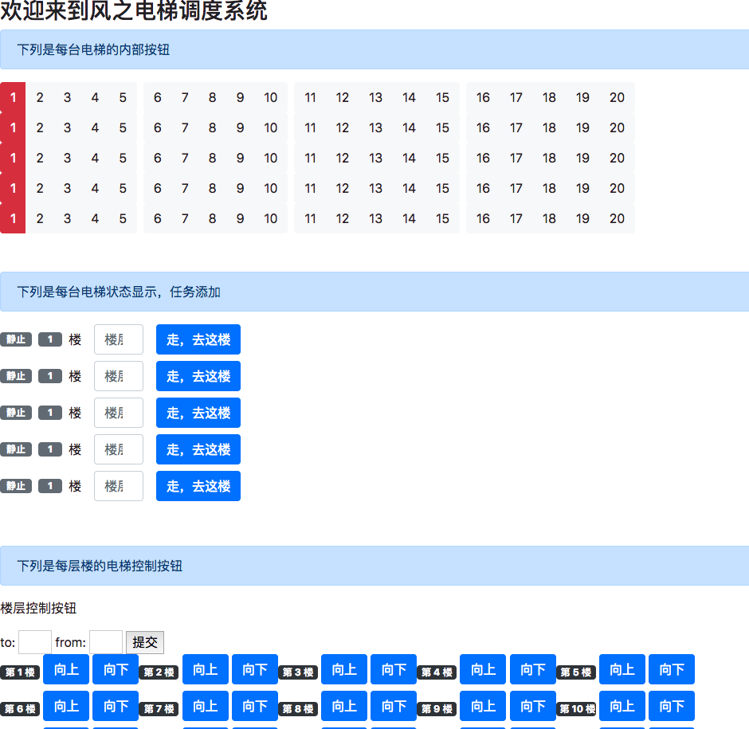
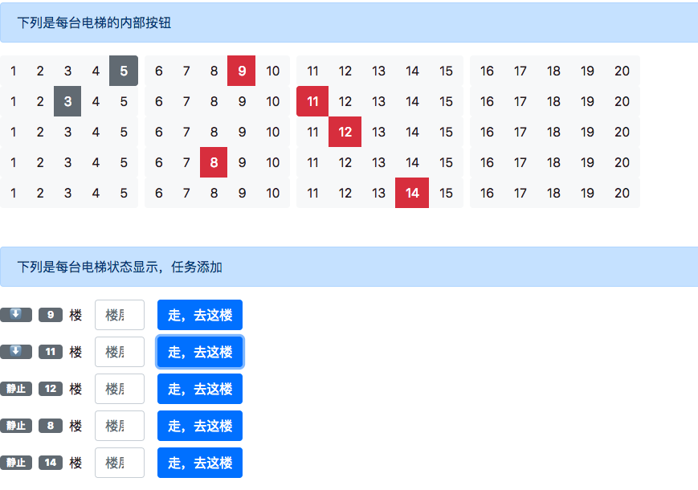
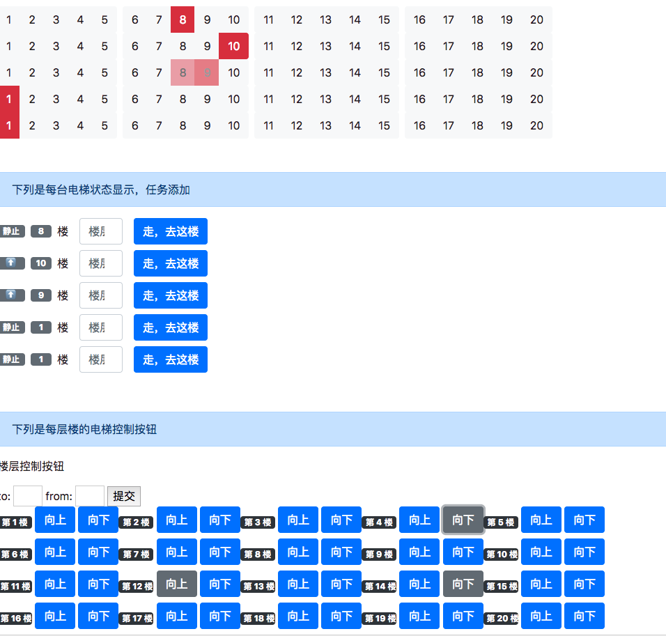
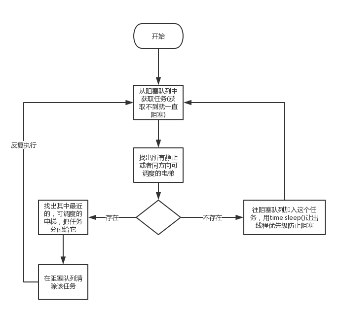
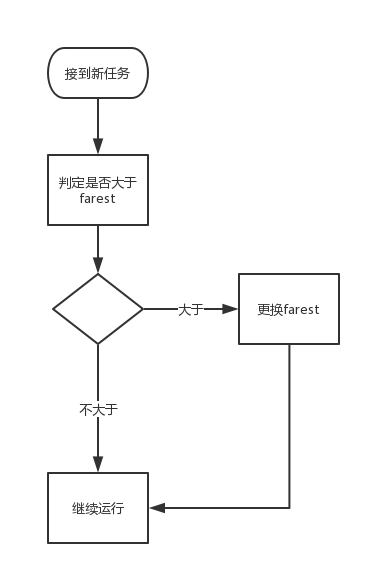

# 电梯调度算法设计
## 启动电梯

项目环境：`Python 3.6.5`

本项目配置了`docker`.

运行可以在目录下

`docker build -t fxw:test .`

`docker run -p 5000:5000 fxw:test`

并访问http://localhost:5000.

如果配置了Python环境，可以

```
virtualenv venv
source venv/bin/activate
pip install -r requirements.txt

python manage.py
```

并访问http://localhost:5000.

如果以上不行，可以访问我的网站：

http://maplewish.cn/lifts

注意，以上的电梯程序可以同时处理多个用户，所以我的网站最开始可能不是全部在1楼的状态。

## 用户接口与使用

### 全局界面



### 楼层按键



在电梯内部，按键后，电梯状态显示会添加楼层和运动状态

同时，灰色的部分表示楼层内xx楼的按钮是亮的。

输入数字按“走，去这楼”或者直接按楼层都可以有这个效果。

### 楼层按钮

按理说题目要求“一楼有五个按钮”，但是我觉得做一个跟做20楼五个都亮的也没什么区别…就每层楼做了一个按钮。



可以看到，最下面按钮亮的会变成灰色，由于没有内部任务，所以最上面一排没有变化。但是电梯仍然在运动。

### 添加人物对象

to: from:字段添加人物对象。

## 基本算法

### 电梯的状态
* 上行
* 上行静止
* 下行
* 下行静止
* 静止

1. 上行和下行的状态中有等待的属性。电梯的状态会根据状态开启一个线程，并暴露有这个基本的状态。
2. 有如下的状态转移图

.png)

### 电梯的调度算法
#### 外部任务

程序中，我把“第5楼按上键”这样的**外层按键操作**叫做**外部任务**

我在`LiftControler`里面开启了一个线程，每次有外部的任务请求就放到一个阻塞队列中，这个线程中不断处理调度请求。

```python
    def _start_deamon(self):
        """
        开启一个处理JOB的守护线程
        """
        def task_start():
            while True:
                cur_job = self._remained_jobs.get(block=True, timeout=100000)
                if not self._dispatch_job(cur_job):
                    # 没有成功添加
                    self._remained_jobs.put(cur_job)
                    # 需要放弃线程的优先权
                    time.sleep(0)
        t = Thread(target=task_start)
        t.daemon = True
        t.start()
```

按下电梯后，会在LiftController添加一个信号，这个信号是未受理的。它的内容包含去几楼。

检查这些未受理的信息，找到最好的调度的电梯\(可调度的电梯中选择最近的\)。并删除这个信号。



### 电梯的运行算法
运行中的电梯每隔t1时间会改变一次楼层的属性，修改的时候是lock的。同一层的运行电梯不会被调度。

电梯保有自身的楼层属性和想要去的楼层的信息。这个信息是有序的。

```python
    def __init__(self, lnum: int, controller: 'LiftController'=None):
        with self._class_lock:
            self.lift_objects.append(self)
        # 是一个常量！
        self.LNUM = lnum
        # 反向工作，可能被调度的对象反向行走. 形式为楼层->列表的映射
        self._reversed_jobs: Dict[int, List[Job]] = {i: list() for i in range(1, 21)}
        # 内部需要到达的工作
        self._inner_jobs: Set[int] = set()

        self._state_lock = RLock()
        # 初始化为静止的状态
        self._state = LiftState.REST
        # 父控制者
        self._controller = controller
        # 对应的楼层
        self._floor = 1

        # 需要执行的任务
        self._farest: int = None
        self._task = None
        self._task_lock: RLock = RLock()
```

每次接受外部任务的时候，电梯会试图更新`_farest`属性，这个属性表示电梯“运行时最远的任务”，电梯运行到farest的时候会停止。



.png)

### 电梯的status

```python
def status(self):
    """
    :return: json str of status.
    """
	with self._state_lock:
    return json.dumps({
        'lift_number': self.LNUM,
        'status': self._state.value,
        'floor': self._floor,
    })
```


### SocketIO 事件

本项目是一个web项目，后端使用了flask-socketio + eventlet, 支持多线程。

发送方：服务端

| event              | 数据格式                                                     | 使用时刻                 |
| ------------------ | ------------------------------------------------------------ | ------------------------ |
| lifts all          | ["1": "{\"lift_number\": 1, \"status\": \"rest\"}", "2": "{\"lift_number\": 2, \"status\": \"rest\"}", "3": "{\"lift_number\": 3, \"status\": \"rest\"}", "4": "{\"lift_number\": 4, \"status\": \"rest\"}", "5": "{\"lift_number\": 5, \"status\": \"rest\"}"] | 广播现有的所有电梯的数据 |
| lift change        | {"floor": 12, "status": "up", "lift_number": 9}              | 单个电梯楼层等状态变化   |
| lift status change | {\"lift_number\": 1, \"status\": \"rest\"}                   | 到达某个约定的层         |
| lift innertask     | {"lift_number": 1, "tasks": [1, 2, 3, 4]}                    | 电梯内部产生任务         |
| floor button       | {"floor": 12, "key": "up", "light": true}                    | 楼层的一个按键亮或者暗   |

发送方：客户

| event     | 数据格式                    | 使用时刻     | 响应                         |
| --------- | --------------------------- | ------------------------------------ |------------------------------------ |
| add job   | {"from": 1, "to": 2}        | 在电梯口按按钮上行-下行调度时        |add_job|
| inner job | {"lift_number": 1, "to": 9} | 在电梯内部按按钮上行-下行-几楼调度时 |add_inner_job|
| outer job | {"floor": 2, "direc": "up"} | 在电梯按下上行／下行按钮             |add_inner_job|


## 算法问题

1. 正向、反向调度
   产生作业信息中，会在楼层的反向事件中增加任务，如果到这一层但是并不停在这一层，会触发，将这个任务再度加入调度队列。
2. 楼层按键与外层按键
   楼层按键必定响应，外层按键同向响应
3. 楼层选择
   同层的模型能够被选择，否则无法同向选择

## 主要的模型

### Lift


### Floor

floor 任务负载，处理外层任务

## 架构

### main

主程序，提供 flask 接口，给各个信息路由提供反应

### LiftUtils

#### Jobs

单个任务

#### Lift

单个电梯的信息

#### LiftController

电梯控制器

#### Task

任务的集合


