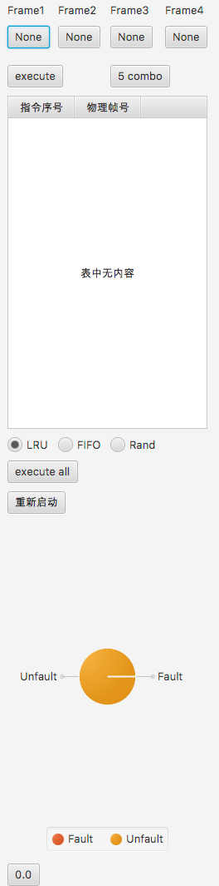
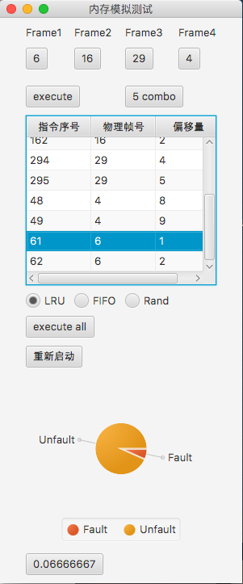
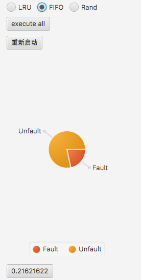

# Tongji Memory Lab

## QuickStart

运行对应的.jar文件，可以看到如下的界面：



我们可以看到下列的按钮：

1. execute : 执行一条指令
2. 5 combo : 执行五条指令
3. execute all : 执行全部指令

同时有以下的选择栏，表示对比的页面置换算法

1. LRU\(默认最初显示\)
2. FIFO
3. RAND

显示的有3项

1. 饼状图 + 小数数字，表示对应的缺页率
2. 指令序号 — 物理序号对应的表，表示对应的指令执行
3. Frame1 ～ Frame4的显示，表示算法对应的Frame

下面是模拟运行：



可以看到，缺页率、指令序号等对应显示在图中。如果需要对比多种算法，可以按对应算法的按钮，得到这个算法对应的数据。 以下是rand 算法和 FIFO算法对应的数据：




当你执行完全部指令后，可以自行选择对应重启，燃尽诶面归零，重新启动程序。

## 模块和架构

详细情况可以看文档中对应的[Javadoc](./doc/main.html)

### 内存模拟

#### HardDiskMemory

次级存储器，这里模拟磁盘进行存储，能够进行载入物理Frame、导出物理Frame的功能.

#### PhysicsMemory

用来表示物理内存的类。这里能够存储对应的物理页面，并且能够将页面逐出，放入HardDiskMemory, 也能导入物理Frame。

#### VirtualMemery

虚拟内存，通过MMUTranslator在物理内存寻址。用户通过worker操作虚拟内存来查找对应的指令。

#### Code

表示抽象的代码，可以被直接执行.

#### Frame

物理的Frame, 存有实际的code的信息，能够存储在。

#### PageTable

页表，用于将虚拟内存VPN映射到实体的物理PFN。如果目标不在物理内存中会抛出异常。

#### PageTableEntity

页表项
页表中存储的实体，用于映射到真正的物理空间。
同时根据保护位等信息表示对应的物理信息是否在物理内存中，或者这块内存是否被初始化／使用

#### MMUTranslator

MMU 转换器，能够将虚拟地址转换成物理空间的地址。调用`PageTable` 和`TLB`来实现目标。

这个模块的Translator能够处理异常，并且加载对应的PTE的物理页。

#### TLB

用于优化物理内存寻址的表，这里尚未实现。

### 页面置换算法

#### EvictBase

在这里，缓存置换算法都是EvictBase的子类，EvictBase的信息如下：

```java
/**
 * 基本的替换算法的基类
 * 参考：http://flychao88.iteye.com/blog/1977653
 */
public abstract class EvictBase {
    final int lruSize;

    /**
     * 获得自用的缓存置换算法的算法名称
     * @return 算法名称
     */
    public String getEvictAlgoName() {
        return evictAlgoName;
    }

    protected String evictAlgoName;
    public EvictBase(int lruSize) {
        this.lruSize = lruSize;
    }

    /**
     * 表示对应位置的物理内存被使用
     * @param frameID
     */
    public abstract void codeUse(int frameID);

    /**
     * 返回应该evict的物理内存的ID
     * @return
     */
    public abstract int evictID();

    @Override
    public String toString() {
        return "EvictAlgorithm " + evictAlgoName;
    }
}
```

这里我实现了对应的FIFO LRU RAND三种置换算法。

### 随机数生成

这里实现了两种随机生成指令的算法，效果比较好的采取如下方法：用对应的状态机，生成一定序列的指令：

```java
public class RCodeGenerator implements Iterator<Integer> {
    private Stack<Integer> stack = new Stack<>();
    /**
     * 最多生成的指令
     */
    private final int maxExec;
    private int[] addresses;
    void generateAddress() {
        Random random = new Random();
        // records the last address to be stored
        int last = random.nextInt(maxExec);
        int flag = 0;
        for (int i = 0; i < maxExec; ++i) {
            addresses[i] = last;
            if (flag % 2 == 0) {
                // flag == 0 || flag == 2
                last = (last + 1) % maxExec;
            }
            else if (flag == 1) {
                if (last == 0) {
                    last = 0;
                }
                else {
                    last = random.nextInt(last - 1);
                }
            }
            else {
                // flag == 3
                last = last + 1 + random.nextInt(maxExec - (last + 1));
            }
            flag = (flag + 1) % 4;
        }
    }

    private int curIndex;

    public RCodeGenerator(int maxExecute) {
        maxExec = maxExecute;
        addresses = new int[maxExecute];
        generateAddress();
        curIndex = 0;
    }

    @Override
    public boolean hasNext() {
        return curIndex < maxExec;
    }

    @Override
    public Integer next() {
        return addresses[curIndex++];
    }
}
```

flag 表示状态。这里实现了迭代器的接口，让后面能够像迭代器一样使用这个生成器。 


